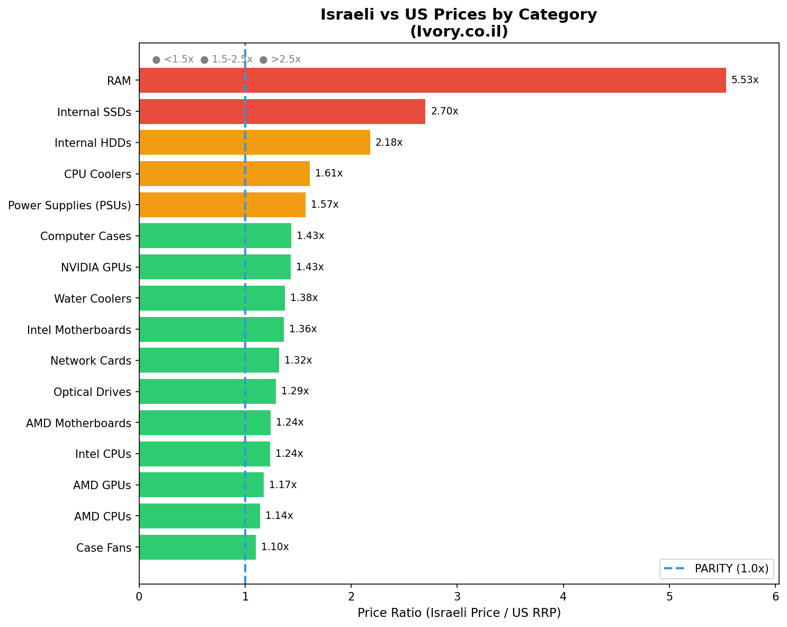
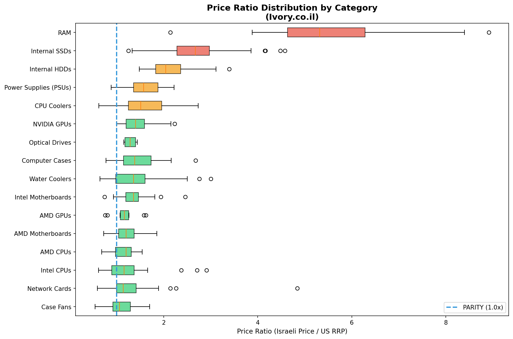
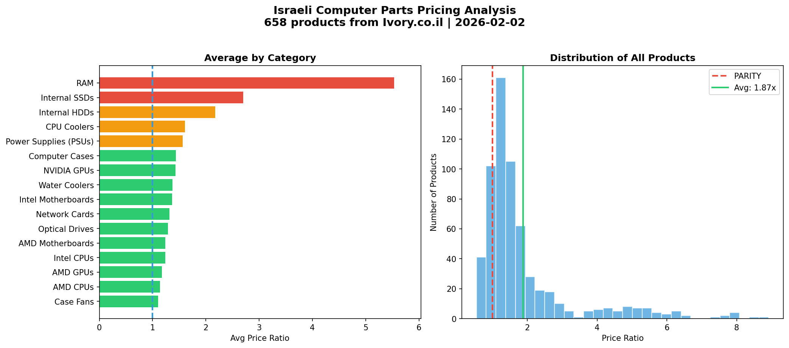

# Ivory Parts Finder

A tool for exporting product data from Ivory (ivory.co.il), an Israeli computer parts retailer, into machine-readable JSON format with LLM-powered enrichment for price comparison.

## Price Analysis Summary

**Overall average: Israeli prices are 1.87x US RRP** (based on 620 products with verified price data).

> **Note**: This analysis compares Israeli retail prices against US **Recommended Retail Prices (RRP/MSRP)**, not spot/market prices. Actual US street prices may vary.

### Price Ratios by Category (Israeli Price / US RRP)

| Category | Products | Avg Ratio |
|----------|----------|-----------|
| Case Fans | 47 | 1.10x |
| AMD CPUs | 38 | 1.14x |
| AMD GPUs | 10 | 1.17x |
| Intel CPUs | 44 | 1.24x |
| AMD Motherboards | 45 | 1.24x |
| Optical Drives | 4 | 1.29x |
| Network Cards | 41 | 1.32x |
| Intel Motherboards | 53 | 1.36x |
| Water Coolers | 47 | 1.38x |
| NVIDIA GPUs | 25 | 1.43x |
| Computer Cases | 60 | 1.43x |
| Power Supplies (PSUs) | 39 | 1.57x |
| CPU Coolers | 44 | 1.61x |
| Internal HDDs | 15 | 2.18x |
| Internal SSDs | 48 | 2.70x |
| RAM | 60 | 5.53x |
| **Overall** | **620** | **1.87x** |

**Key findings:**
- Most components are 1.1x-1.6x US RRP (reasonable import markup)
- CPUs and GPUs are competitively priced (~1.1-1.4x)
- Storage (SSDs, HDDs) has significant markup (~2-2.7x)
- RAM has the highest markup (~5.5x US RRP)

### Visualizations

#### Price Ratio by Category


#### Price Distribution


#### Summary Analysis


## Purpose

This repository provides a way to periodically capture product listings from Ivory's website including:
- Product name (Hebrew) and English description
- Price (regular price, excluding Eilat tax-free pricing)
- Product URL and stock availability
- **LLM-enriched data**: Manufacturer, part number, US RRP
- **Price comparison**: Israeli price as a ratio of US retail price

## Methodology

### Data Collection
1. **Web Scraping**: Product data is scraped from Ivory's category pages using BeautifulSoup
2. **Pagination**: All pages in each category are automatically traversed
3. **Price Extraction**: Regular prices are captured (Eilat tax-free prices are excluded)

### LLM Enrichment
1. **Model**: Google Gemini 2.0 Flash processes products in batches
2. **First Pass** - Extracts:
   - Manufacturer name
   - Part number/SKU (when identifiable)
   - English product description
   - Initial US RRP estimate
3. **Second Pass** - Verifies US RRP estimates with category-specific pricing guidelines

### Price Comparison
1. **Exchange Rate**: NIS/USD rate is fetched once per run from public APIs
2. **Conversion**: Israeli prices are converted to USD
3. **Ratio Calculation**: `price_ratio = price_usd / us_rrp_usd`
   - A ratio of 1.0 means the Israeli price equals US retail
   - A ratio of 2.0 means the Israeli price is 2x US retail

### Limitations
- **RRP vs Spot Prices**: US prices are Recommended Retail Prices (RRP/MSRP), not current market/spot prices. Actual US street prices may be lower due to sales, promotions, or market conditions.
- US RRP estimates are LLM-generated and may not reflect exact current prices
- Very new products may not have accurate US pricing data
- Exchange rates fluctuate; ratios are point-in-time snapshots

## Requirements

- Python 3.8+
- Must be run from within Israel (Ivory blocks international access)
- **Gemini API key** (required for LLM enrichment)

### API Key Setup

You need a Google Gemini API key for LLM enrichment. Get one free at [Google AI Studio](https://aistudio.google.com/apikey).

```bash
# Option 1: Environment variable
export GEMINI_API_KEY=your_key_here

# Option 2: .env file (recommended)
echo "GEMINI_API_KEY=your_key_here" > .env
export $(cat .env | xargs)
```

**Note**: The `.env` file is gitignored to protect your API key.

## Installation

```bash
cd /path/to/Ivory-Parts-Finder
python -m venv .venv
source .venv/bin/activate
pip install -r requirements.txt
```

Or with `uv`:
```bash
uv venv .venv && source .venv/bin/activate && uv pip install -r requirements.txt
```

## Usage

### List available categories
```bash
python scraper.py --list-categories
```

### Scrape all categories (with LLM enrichment)
```bash
export $(cat .env | xargs)  # Load API key
python scraper.py
```

### Scrape without LLM enrichment (faster, no API key needed)
```bash
python scraper.py --no-enrich
```

### Scrape specific category
```bash
python scraper.py --category internal-ssds
python scraper.py --category intel-cpus
python scraper.py --category nvidia-gpus
```

### Validate existing export
```bash
python scraper.py --validate-only exports/ivory_products_latest.json
```

## JSON Schema

```json
{
  "capture_date": "2026-02-02T16:06:36.066820",
  "source": "ivory.co.il",
  "exchange_rate_ils_to_usd": 0.323,
  "total_products": 658,
  "categories": {
    "Storage": {
      "internal-ssds": {
        "description": "Internal SSDs",
        "group": "Storage",
        "url": "https://www.ivory.co.il/ssd_storage.html",
        "product_count": 48,
        "products": [
          {
            "id": "59252",
            "name": "כונן Samsung 990 Pro MZ-V9P2T0BW PCle 4.0 NVMe M.2 2TB SSD",
            "price": 1290,
            "currency": "ILS",
            "url": "https://www.ivory.co.il/catalog.php?id=59252",
            "in_stock": true,
            "manufacturer": "Samsung",
            "part_number": "MZ-V9P2T0BW",
            "description_en": "Samsung 990 Pro 2TB PCIe 4.0 NVMe M.2 SSD",
            "us_rrp_usd": 170,
            "price_usd": 416.67,
            "price_ratio": 2.45
          }
        ]
      }
    }
  }
}
```

### Field Descriptions

| Field | Description |
|-------|-------------|
| `id` | Ivory product ID |
| `name` | Hebrew product name from Ivory |
| `price` | Price in ILS (excludes Eilat pricing) |
| `url` | Direct link to product page |
| `in_stock` | Stock availability |
| `manufacturer` | Brand name (LLM-extracted) |
| `part_number` | SKU/model number (LLM-extracted) |
| `description_en` | English description (LLM-generated) |
| `us_rrp_usd` | Estimated US retail price (LLM-estimated) |
| `price_usd` | Israeli price converted to USD |
| `price_ratio` | `price_usd / us_rrp_usd` (e.g., 2.45 = Israeli price is 2.45x US price) |

## Categories

| Group | Key | Description |
|-------|-----|-------------|
| CPU | `intel-cpus` | Intel CPUs |
| CPU | `amd-cpus` | AMD CPUs |
| Motherboard | `intel-motherboards` | Intel Motherboards |
| Motherboard | `amd-motherboards` | AMD Motherboards |
| Memory | `ram` | RAM |
| Storage | `internal-ssds` | Internal SSDs |
| Storage | `internal-hdds` | Internal HDDs |
| Graphics | `nvidia-gpus` | NVIDIA GPUs |
| Graphics | `amd-gpus` | AMD GPUs |
| Power | `power-supplies-psus` | Power Supplies (PSUs) |
| Cooling | `cpu-coolers` | CPU Coolers |
| Cooling | `water-coolers` | Water Coolers |
| Cooling | `case-fans` | Case Fans |
| Case | `computer-cases` | Computer Cases |
| Peripherals | `network-cards` | Network Cards |
| Peripherals | `optical-drives` | Optical Drives |

## Exports

The `exports/` directory contains JSON exports from scraper runs:
- `ivory_products_latest.json` - Most recent full export
- Timestamped files for historical tracking

## Notes

- Eilat prices (tax-free zone) are intentionally excluded
- Exchange rate is fetched once per run from public APIs (exchangerate-api.com)
- LLM enrichment uses Gemini 2.0 Flash for cost efficiency
- Rate limiting is built in (1 second between web requests, 0.5 seconds between LLM calls)
- Products are processed in batches of 5 for LLM enrichment
